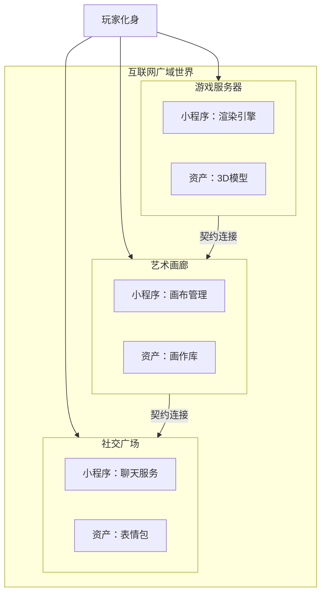

## 架构示意（中文术语）

> 注：此图为概念架构图，采用中文术语定义（Site = 场所, Program = 小程序, Contract = 契约）。

---

## 名称含义

**Web Wide World** 这个名字包含两层意思，两者都很重要：

**（Web Wide）World** —— 一个跨越整个互联网的世界。  
不是一个平台，也不是一家公司。而是一个去中心化的网络，每个网站都可以成为这个世界的组成部分。

**Web（Wide World）** —— 一个通过互联网体验的广阔世界。  
无穷无尽的地方、社区和体验——全部可达，全部互联。

加起来就是：一套协议，让一个共享的虚拟世界能够在互联网上有机生长，任何节点都可以参与，任何用户都能探索。

---

## 我们要做什么

构成虚拟世界的技术（3D、社交、持久化）已经足够成熟。游戏、数字孪生、VR、社交平台……这些零件都有了。

缺少的是“胶水”。一套共享的标准，让独立的努力相互连接而不是相互竞争。

这个项目定义这套标准。任何网站都可以托管世界的一部分。资产和用户可以在不同场所间自由移动。没人能够独占它的一切。

## 关键问题

1. **资产归属** —— 资产储存在哪里，谁拥有控制权
2. **场所层级** —— 场所之间如何连接、如何互信
3. **权限体系** —— 跨场所与跨服务的访问授权机制
4. **版本同步** —— 各场所独立更新，但同时保持全球同步
5. **多用户互动** —— 分布在不同场所的用户实时感知与交互

## 目标

- 定义一套适用于互联网共享虚拟世界的开放标准
- 降低任何开发者或站点参与的门槛
- 建造一个属于所有人的世界，而非单一平台

## 3DGS 实践演示

要了解 3D 高斯泼溅渲染（3DGS）如何集成到 web 虚拟世界中，请查看：
**[https://web-wide-world.space/viewer2](https://web-wide-world.space/viewer2)**

此在线演示加载了一个基于 3DGS 构建的完全交互式中国园林场景：
- 7 个空间区域（按需加载/卸载）
- 5 个带动画与对话的 NPC
- 动态区域替换系统（基于距离的 LOD）
- 使用腾讯 3DGS 查看器（`spark` 格式）

此演示展示了 Web Wide World 概念的现代 3D 网页技术实际落地案例。

## 当前状态

早期阶段，正在定义协议规范。欢迎讨论与贡献。

## 分享通道

- 🇨🇳 此为中文说明文档，原版英文版见 [README.md](README.md)
- 💬 中文相关问题可使用 [`lang/zh-CN`](https://github.com/nobody-and-everybody/web-wide-world/labels/lang/zh-CN) 标签提交 Issue
- 🔗 术语对照表参见 [术语对照表 (Glossary)](docs/zh-CN/glossary.md)